# <a href= "https://www.inteli.edu.br/"></a> Instituto de Tecnologia e Liderança

# Nome do projeto

## Nome do grupo

## :student: Integrantes

- <a href="https://www.linkedin.com/in/brunomleao/">Bruno Leão</a>
- <a href="https://www.linkedin.com/in/emely-tavares-3575ba24a/">Emely Tavares</a>
- <a href="https://www.linkedin.com/in/felipe-martins-moura-1bbb27157/">Felipe Moura</a>
- <a href="https://www.linkedin.com/in/marcelo-saadi-pessini-003212209/">Marcelo Saad</a>
- <a href="https://www.linkedin.com/in/vitor-santos-851408196/">Vitor Rodrigues</a>
- <a href="https://www.linkedin.com/in/yago-araújo-do-vale-moreira-461816247/">Yago Araújo</a>

## :teacher: Professores

### Orientador(a)

- <a href="https://www.linkedin.com/in/vanunes/">Vanessa Nunes</a>

### Instrutores

- <a href="https://www.linkedin.com/in/jose-romualdo/">Programação - José Romualdo</a>
- <a href="https://www.linkedin.com/in/seulogin/">Matemática e Física - Geraldo Vasconcelos</a>
- <a href="https://www.linkedin.com/in/seulogin/">Negócios - Lisane Valdo</a>
- <a href="https://www.linkedin.com/in/seulogin/">Design - Guilherme Henrique de Oliveira Cestari</a>
- <a href="https://www.linkedin.com/in/seulogin/">Liderança - Filipe Gonçalves</a>

## Conteúdo

**[1. Visão Geral do Projeto](#1-visão-geral-do-projeto)**

- [1.1. Parceiro de Negócios](#11-parceiro-de-negócios)
  - [1.1.1. Partes Interessadas](#111-partes-interessadas)
  - [1.1.2. Análise da Indústria](#112-análise-da-indústria)
- [1.2. Problema](#12-problema)
  - [1.2.1. Análise do Problema](#121-análise-do-problema)
  - [1.2.2 Análise do cenário: Matriz SWOT](#122-análise-do-cenário-matriz-swot)
- [1.3. Descritivo da Solução](#13-descritivo-da-solução)
  - [1.3.1. Objetivos](#131-objetivos)
  - [1.3.2. Proposta de Valor: Value Proposition Canvas](#132-proposta-de-valor-value-proposition-canvas)
  - [1.3.3. Matriz de Risco](#133-matriz-de-risco)
- [1.4. Proposta Tecnológica e Benefícios](#14-proposta-tecnológica-e-benefícios)
  - [1.4.1. Tipo de arquitetura de nuvem escolhida](#141-tipo-de-arquitetura-de-nuvem-escolhida)
  - [1.4.2. Arquitetura de nuvem escolhida](#142-arquitetura-de-nuvem-escolhida)
  - [1.4.3. Benefícios trazidos pela arquitetura de nuvem proposta](#143-benefícios-trazidos-pela-arquitetura-de-nuvem-proposta)

**[2. Entendimento da Experiência do Usuário](#2-entendimento-da-experiência-do-usuário)**

- [2.1. Perfis de Usuários](#21-perfis-de-usuários)
  - [2.1.1. Personas](#211-personas)
- [2.2. Mapa de Jornada do Usuário](#22-mapa-de-jornada-do-usuário)
- [2.3. Wireframes](#23-wireframes)

**[3. Requisitos](#3-requisitos)**

- [3.1. Requisitos Funcionais](#31-requisitos-funcionais)
  - [3.1.1. Casos de Uso](#311-casos-de-uso)
  - [3.1.2. User Stories](#312-user-stories)
- [3.2. Requisitos não Funcionais](#32-requisitos-não-funcionais)

**[4. Arquitetura do Sistema](#4-arquitetura-do-sistema)**

- [4.1. Diagrama de Arquitetura](#41-diagrama-de-arquitetura)
- [4.2. Diagrama de Implantação](#42-diagrama-de-implantação)
  - [4.2.1. Procedimentos de implantação da solução](#421-componentes-que-compões-a-solução)
  - [4.2.2. Procedimentos de implantação da solução](#422-procedimentos-de-implantação-da-solução)
    - [4.2.2.1 Backend mock](#4221-backend-mock)
    - [4.2.2.2 Processo de deploy](#4222-processo-de-deploy)
    - [4.2.2.3 Demonstração de Integração](#4223-demonstração-de-integração)
- [4.3. Diagrama de Sequência](#43-diagrama-de-sequência)
- [4.4. Backend com Banco de Dados](#44-backend-com-banco-de-dados)

**[5. Projeto e Implementação UX e UI](#5-projeto-e-implementação-ux-e-ui)**

  **[5.1. Frontend](#51-frontend)**

**[6. Projeto de Banco de Dados](#6-projeto-de-banco-de-dados)**

  **[6.1. Modelo Conceitual](#61-modelo-conceitual)**
  **[6.2. Modelo Lógico](#62-modelo-lógico)**

**[7. Testes de Software](#7-testes-de-software)**

**[8. Documentação da API](#8-documentação-da-api)**

**[Referências](#referências)**

**[Apêndice](#apêndice)**

# 1. Visão Geral do Projeto

## 1.1 Parceiro de Negócios

O INTELI é uma empresa de médio porte, com uma equipe multidisciplinar de profissionais altamente qualificados nas áreas de tecnologia, design, negócios e inovação. Atuando como uma instituição de ensino superior, tem como missão oferecer uma educação inovadora e voltada para o desenvolvimento de líderes e profissionais altamente qualificados. Sua abordagem pedagógica inclui a Aprendizagem Baseada em Projetos (PBL), visando proporcionar aos estudantes uma experiência de aprendizado prático e aplicado. No mercado de ensino superior e formação profissional, o INTELI se destaca por sua ênfase na inovação e na colaboração, preparando os estudantes para os desafios do mundo real. Seu posicionamento sólido é evidenciado por sua capacidade de formar profissionais capazes de contribuir efetivamente para as transformações no mercado de trabalho, destacando-se como uma instituição inovadora e diferenciada no campo educacional.

### 1.1.1 Partes Interessadas

Analistas do Escritório de Projetos (INTELI):

São responsáveis por gerenciar a plataforma, revisar as propostas de projetos, analisar a compatibilidade com os módulos e alocar as empresas aos projetos. Monitoram o progresso e garantem que os objetivos sejam alcançados.

Empresas Parceiras:

Propõem projetos colaborativos, interagem com os analistas de projetos para aprovação e alocação, colaboram com os estudantes durante as etapas do projeto e avaliam o desempenho e os resultados.

INTELI:

Fornecerá o contexto acadêmico, curricular e tecnológico necessário para a implementação da plataforma. Vai integrar a plataforma às práticas de aprendizado e coordenar a colaboração entre estudantes e empresas.

### 1.1.2 Análise da Indústria

O INTELI (Instituto de Tecnologia e Liderança), empresa fundada em 2020, é uma instituição de ensino superior sem fins lucrativos que utiliza um método de ensino baseado em projetos. A instituição foi fundada depois de uma doação de 200 milhões da família André Esteves junto ao BTG Pactual com o objetivo de formar jovens extremamente qualificados e resolver a questão da falta de mão de obra especializada em tecnologia no Brasil.

A indústria na qual o INTELI está inserido é a educação e a inovação tecnológica. Nesse cenário, a instituição de ensino tem a responsabilidade de preparar os estudantes para os desafios do mercado de trabalho em constante evolução, enquanto as empresas buscam novas maneiras de incorporar inovações e tecnologias avançadas em seus processos e produtos.

Como concorrentes não podemos citar nenhuma faculdade de tecnologia que aplique o modelo PBL (Project Based Learning), entretanto podemos citar a Link School Of Business, que utiliza o modelo PBL mas é uma faculdade focada em empreendedorismo. Como faculdades de tecnologia que não utilizam PBL podemos citar o INSPER, Ensino Einsten, IME USP.

### 1.1.2.1 5 Forças de Porter

Abaixo temos uma análise de indústria utilizando as cinco forças de Porter:

(figura 1: 5 Forças de Porter)


**fonte:** elaboração dos autores

## 1.2 Problema

O desafio está na ausência de uma plataforma dedicada à gestão de parcerias entre empresas e estudantes para projetos colaborativos no formato PBL. Essa lacuna dificulta a coordenação, o monitoramento das propostas e a alocação dos projetos sugeridos aos módulos abertos do trimestre, considerando a ampla variedade de disciplinas e o aumento das turmas participantes. Atualmente, esses processos são conduzidos manualmente, utilizando planilhas.

**Oportunidade de Negócio:**

A oportunidade reside na criação de uma plataforma web de gestão de parcerias dedicada aos projetos PBL no INTELI. Essa plataforma tem o potencial de transformar a maneira como empresas e estudantes colaboram, permitindo uma seleção e alocação mais eficaz de projetos, monitoramento em tempo real do progresso e avaliação de resultados. Ao automatizar e otimizar esses processos, a plataforma pode oferecer um ambiente mais propício à inovação, promovendo o alinhamento entre os objetivos das empresas e os objetivos educacionais do INTELI.

Ao abordar esse problema e aproveitar a oportunidade de negócio, a plataforma de gestão de parcerias pode trazer benefícios significativos para ambas as partes envolvidas. As empresas terão acesso a projetos alinhados com suas áreas de interesse, permitindo colaborações mais produtivas e uma experiência de aprendizado realista para os estudantes. O INTELI, por sua vez, poderá oferecer uma educação mais prática e alinhada com as necessidades da indústria, reforçando sua reputação como uma instituição inovadora e proporcionando um diferencial competitivo.

### 1.2.1 Análise do Problema

Descreva os problemas identificados e as necessidades do usuário, bem como uma avaliação da situação atual e as possíveis soluções para cada questão. Além disso, identifique os obstáculos e limitações do projeto, a fim de assegurar que todas as preocupações sejam abordadas antes do início da implementação. A Análise do Problema é essencial para garantir que a solução do software seja eficaz e atenda às necessidades dos usuários. É importante que seja realizada uma pesquisa exaustiva e que todas as perspectivas sejam consideradas para garantir que a solução seja bem-sucedida.

### 1.2.2 Análise do cenário: Matriz SWOT

(figura 2: Matriz SWOT)

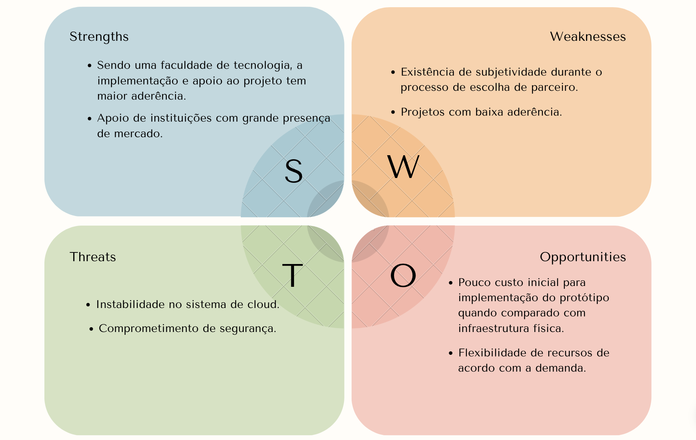

**fonte:** elaboração dos autores

Por meio da matriz SWOT podemos entender o cenário competitivo do mercado, auxiliando na tomada de decisões e planejamentos estratégicos.

## 1.3 Descritivo da Solução

**Problema a ser Resolvido**

Desde do início da operação, o escritório de projetos do INTELI utiliza de ferramentas artesanais para fazer o controle avançado de relacionamento com parceiros de mercado e também a seleção de iniciativas para a inserção no ano letivo. Um dos principais mecanismos utilizados é o Excel e email , que, após a expansão crescente da faculdade, não está sendo mais eficiente. A organização agora conta com mais de 100 parceiros e a alocação de cada um, por meio da planilha, fica inviável.

**Arquitetura de Nuvem Escolhida**

Para essa aplicação, utilizaremos a seguinte arquitetura AWS:

(figura 3: arquitetura AWS)

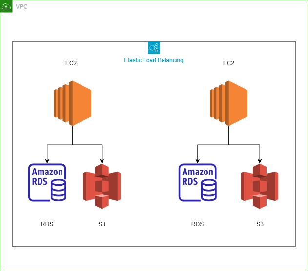

**fonte:** elaboração dos autores

**Justificativa**

A arquitetura acima deve ser utilizada, pois garante que os pontos críticos da aplicação sejam cumpridos. São eles: segurança e performance.

- 1 - Segurança: com o uso da VPC (Virtual Private Cloud), a aplicação estará em uma nuvem privada que impedirá o acesso a dados sensíveis da aplicação, como: contatos e identificadores dos parceiros de mercado.

- 2 - Performance: A criação de duas instâncias EC2 (Elastic Compute Cloud), as quais podem ser auto escaladas conforme demanda, intensifica a performance da aplicação caso haja o uso intenso de persistência de dados.

**Como a Arquitetura Deve Ser Utilizada**

Para garantir o máximo proveito da arquitetura falada, os seguintes passos devem ser seguidos:

- 1. Criar uma Virtual Private Cloud (VPC) na AWS para isolar e gerenciar a infraestrutura da aplicação.

- 2. Configurar o Load Balancer para distribuir o tráfego de entrada entre as duas instâncias EC2, garantindo alta disponibilidade.

- 3. Criar duas instâncias EC2, conectadas à VPC, para hospedar a aplicação.

- 4. Conectar cada instância EC2 a um bucket no S3 para armazenar dados estáticos, como imagens e outros arquivos.

- 5. Conectar cada instância EC2 a um volume EBS para armazenar dados dinâmicos e bancos de dados necessários para o funcionamento da aplicação.

- 6. Implementar medidas de segurança, como grupos de segurança e controle de acesso, para proteger a VPC e os recursos.

**Quais os benefícios trazidos pela arquitetura de nuvem proposta**

A utilização dessa modelagem garante que os requisitos do projeto sejam cumpridos, como: disponibilidade, performance, e segurança. Assim, podemos definir cada benefício desse alinhado com os componentes da arquitetura dessa seguinte forma:

- 1. Alta Disponibilidade: Com o Load Balancer distribuindo o tráfego entre as instâncias EC2 e a redundância proporcionada pelo uso de múltiplas zonas de disponibilidade, a arquitetura garante alta disponibilidade do aplicativo. Caso uma instância apresente falha, o Load Balancer redirecionará as solicitações para instâncias saudáveis.

- 2. Performance: A utilização de instâncias EC2 conectadas a um EBS e S3 permite armazenar e acessar dados de forma eficiente, resultando em uma melhora significativa no desempenho do aplicativo.

- 3. Segurança: A configuração adequada de grupos de segurança e controle de acesso aos recursos da VPC garantem a segurança do ambiente. Além disso, a AWS oferece recursos de criptografia de dados em trânsito e em repouso para proteger os dados sensíveis.

- 4. Flexibilidade: A arquitetura baseada na nuvem permite ajustar a infraestrutura conforme necessário, adicionando ou removendo instâncias EC2 e aumentando ou diminuindo o tamanho do EBS conforme a demanda do aplicativo.

### 1.3.1 Objetivos

**Objetivo Geral:**

Desenvolver e implementar uma plataforma web em nuvem que otimize o gerenciamento centralizado das parcerias de projetos do escritório, aprimorando a colaboração entre empresas e estudantes, simplificando a aprovação de parceiros, facilitando a análise de compatibilidade dos projetos com os módulos e melhorando a gestão das etapas de seleção de parceiros. A plataforma deve garantir o cumprimento de prazos e objetivos, oferecendo uma visão abrangente de todas as partes envolvidas e proporcionando uma visão clara de cada parceria proposta em relação aos módulos disponíveis.

**Objetivos Específicos:**

- Desenvolver a Plataforma Web em Cloud:
Criar a infraestrutura técnica e a interface da plataforma web em um ambiente de nuvem, garantindo acessibilidade e escalabilidade.

- Otimizar o Gerenciamento Centralizado:
Implementar recursos que permitam aos analistas de projetos e coordenadores gerenciar as parcerias de forma centralizada, simplificando a administração.

- Facilitar a Aprovação de Parceiros:
Desenvolver um processo de aprovação de parceiros integrado à plataforma, agilizando a revisão e aprovação das propostas.

- Analisar a Compatibilidade com Módulos:
Criar algoritmos que analisem automaticamente a compatibilidade dos projetos propostos com os módulos abertos, facilitando a seleção.

- Gerir Etapas de Seleção de Parceiros:
Desenvolver um fluxo de trabalho que permita a gestão eficaz das etapas de seleção de parceiros, desde a submissão até a alocação.

- Oferecer Visão Clara das Partes Envolvidas:
Criar perfis de empresas e analistas de projetos, proporcionando uma visão clara das partes envolvidas em cada projeto.

- Proporcionar Panorama das Parcerias Propostas:
Desenvolver um painel de controle que mostre de forma visual as parcerias propostas em relação aos módulos disponíveis.

- Garantir Segurança de Dados e Privacidade:
Implementar medidas rigorosas de segurança para proteger os dados dos usuários e garantir a privacidade das informações.

### 1.3.2 Proposta de Valor: Value Proposition Canvas

(figura 4: Value Proposition Canvas)

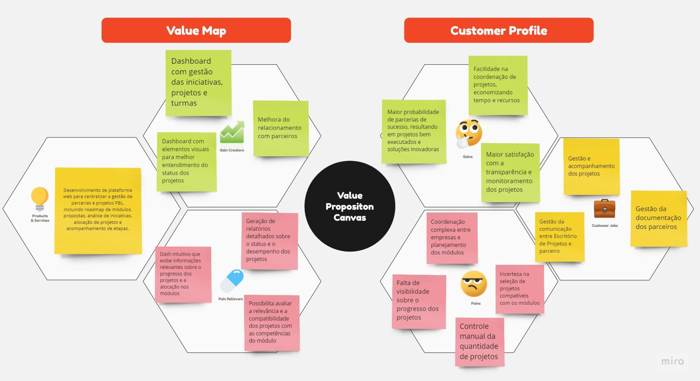

**fonte:** elaboração dos autores

Este Value Proposition Canvas destaca os principais elementos do projeto, incluindo os segmentos de cliente, as tarefas e necessidades dos clientes, a proposta de valor, os benefícios esperados para os parceiros e os principais entregáveis do projeto. Ele fornece uma visão clara das características e funcionalidades que a plataforma de gestão de projetos oferecerá para atender às necessidades dos clientes e atingir os objetivos do projeto.

### 1.3.3  Matriz de Risco

(figura 5: Matriz de Risco)

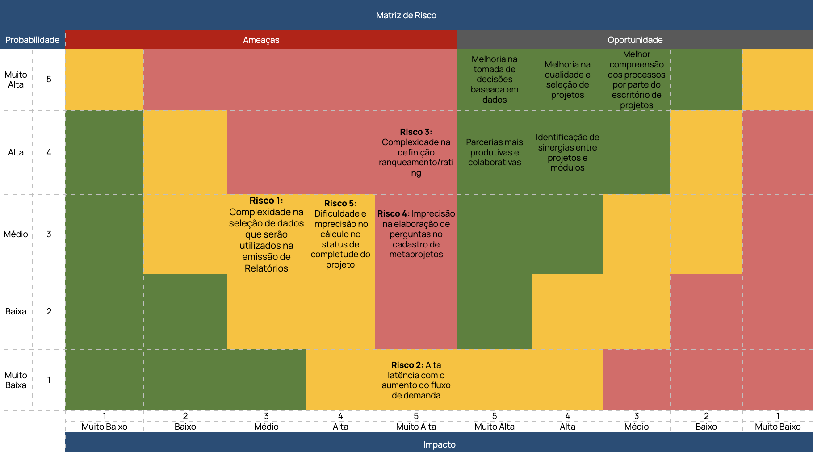

**fonte:** elaboração dos autores

Para garantir o sucesso de um projeto, é importante identificar e mitigar todos os riscos envolvidos no processo. No caso do projeto em questão, foram identificados alguns riscos. Abaixo, apresentamos maneiras de mitigar riscos mapeados:

- Risco 1: Obter com o parceiro(Escritório de Projetos) uma lista detalhada de requisitos de relatórios, especificando os dados necessários que deverão estar presentes em cada documento gerado.

- Risco 2: Escalar adequadamente os recursos de infraestrutura para lidar com picos de demanda e monitorar constantemente o desempenho da plataforma e realizar ajustes conforme necessário.

- Risco 3: Estabelecer critérios claros e objetivos para cada componente do ranqueamento e criar um processo de revisão para validar e ajustar os critérios de ranqueamento. Além disso, buscar obter com o parceiro(Escritório de Projetos) uma orientação detalhada sobre como atribuir valores e ponderações aos critérios de ranqueamento de potenciais empresas parceiras.

- Risco 4: Fornecer um guia claro e abrangente para o preenchimento do cadastro de metaprojetos, com exemplos e explicações. Realizar validações e verificações para garantir que as perguntas sejam claras e relevantes.

- Risco 5: Definir critérios claros e mensuráveis para avaliar o status de completude do projeto e implementar um sistema automatizado para coletar e calcular as informações necessárias para determinar o status.

## 1.4 Proposta Tecnológica e Benefícios

Descreva a proposta tecnológica baseada em nuvem que será adotada no projeto.

### 1.4.1 Tipo de arquitetura de nuvem escolhida

Descreva o tipo de arquitetura de nuvem escolhida e sua justificativa.

### 1.4.2 Arquitetura de nuvem escolhida

Descreva como a arquitetura de nuvem escolhida deverá ser utilizada.

### 1.4.3 Benefícios trazidos pela arquitetura de nuvem proposta

Descreva os benefícios trazidos pela arquitetura de nuvem proposta.

# 2. Entendimento da Experiência do Usuário

Inclua nesta seção os perfis de usuário e respectivas personas, e o mapa de jornada de usuário.

## 2.1. Perfis de Usuários

Descreva instruções detalhadas sobre o uso de cada opção e recursos relacionados ao perfil de cada usuário, garantindo uma experiência fácil e intuitiva para o usuário final.

### 2.1.1 Personas

(figura 6: Persona - Analista)


**fonte:** elaboração dos autores

(figura 7: Persona - Empresa)

.png>)

**fonte:** elaboração dos autores

## 2.2 Mapa de Jornada do Usuário

(figura 8: Mapa de Jornada do Usuário - Analista)


**fonte:** elaboração dos autores

(figura 9: Mapa de Jornada do Usuário - Empresa)

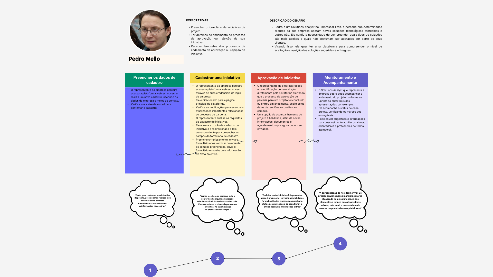

**fonte:** elaboração dos autores

<a href='https://www.canva.com/design/DAFq-Ha7Z_4/wtaZ58aAHrYeqvZdP_j_og/edit?utm_content=DAFq-Ha7Z_4&utm_campaign=designshare&utm_medium=link2&utm_source=sharebutton'> Link para visualização no Canvas  </a>

## 2.3 Wireframes

Descreva as telas de baixa fidelidade das áreas do usuário, de forma conectada, demonstrando a diagramação e o fluxo de navegação.
Exemplos: tela da home, tela de login, etc. Em cada tela colocar: cabeçalho, rodapé, barra lateral, área de conteúdo
Aqui você deve colocar o link para o wireframe ou colocar as imagens geradas na sequência correta do fluxo de navegação.
Além disso: forneça exemplos de como as funcionalidades do software são acessadas e usadas pelos usuários, incluindo informações sobre os passos necessários para realizar tarefas específicas; aborde as principais preocupações de UX, como acessibilidade, usabilidade, consistência e simplicidade; e apresente exemplos de como as telas foram pensadas para atender às necessidades dos usuários com diferentes tipos de habilidades e recursos.

**Tela de cadastro de parceiros**

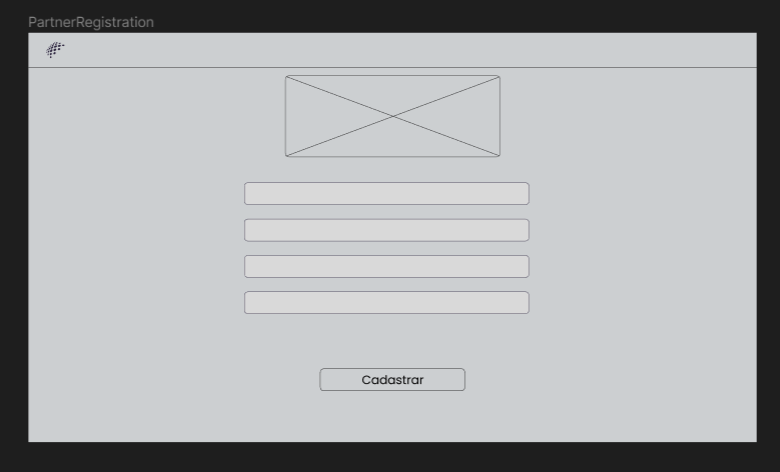

Nessa tela teremos um formulário de cadastro para as empresas que querem se tornar parceiras.

**Tela inicial e cadastro de projetos**

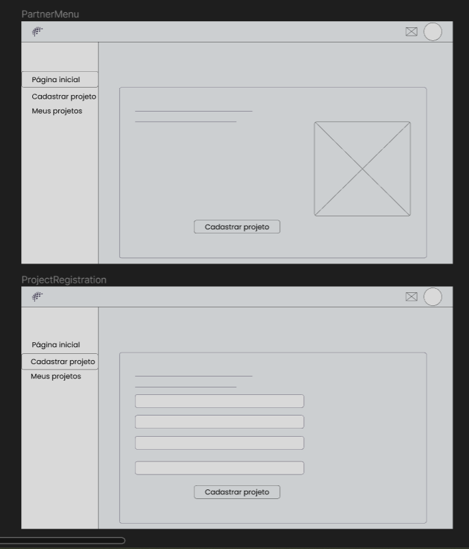

Seguindo o fluxo, após a confirmação de cadastro o parceiro consegue acessar a tela principal onde terá uma mensagem de boas-vindas mais uma solicitação para que cadastre seu primeiro projeto. Clicando em "Cadastrar Projeto" o parceiro vai para uma área destinada a essa funcionalidade. O dashboard comporta uma sidebar onde possui as áreas de navegação, além de uma área, na parte superior e canto direito, destinada as notificações e perfil do usuário, onde poderá fazer alterações:

**Tela de perfil**

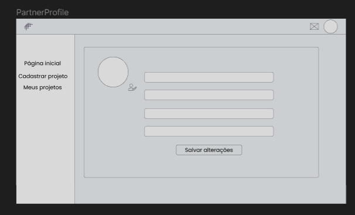

**Tela de visualização de projetos**

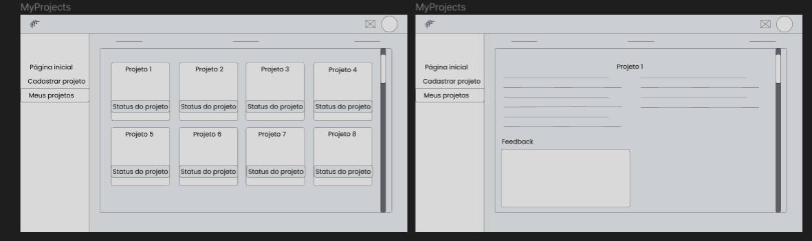

Após o cadastro do projeto ele ficará numa área específica chamada "Meus projetos", onde o parceiro conseguirá acompanhar seu status de análise, se foi aprovado ou não e o desenvolvimento, além de ter um campo para que possa deixar seu feedback ao final do projeto. 

**Tela de login e Tela inicial do analista**

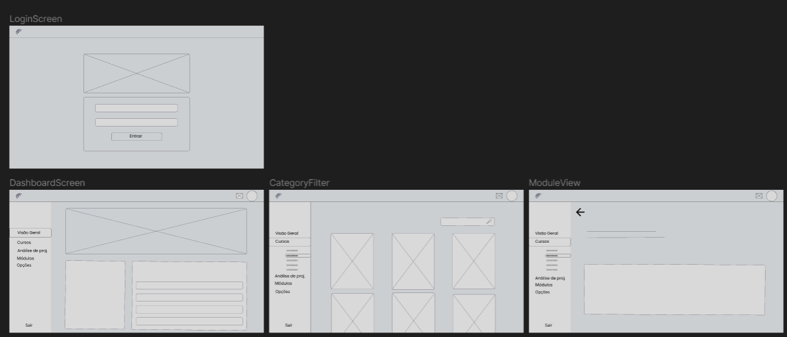

O Analista começa na tela de login para acessar sua conta e seguindo a sequência (de cima para baixo e esquerda para direita), temos o dashboard na tela principal que será composta por gráficos para uma melhor visualizção de todos os processos dentro da plataforma, podendo ser eles: o número de iniciativas para análise, a quantidade de módulos por ano, quantidade de turma e alunos por projeto, quantidade de parceiros com iniciativas ativas ou não. Na terceira tela temos uma ramificação com todos os cursos (Engenharia de Software, Ciências da Computação, Sistemas da Informação e Engenharia da computação) mais o primeiro ano, onde o analista pode ver os módulos existentes para cada curso, além de conter um filtro capaz de separar por turma, módulo ou ramo do projeto. A terceira tela é uma visualização de um módulo aberto. Todas as telas são compostar por uma sidebar que contém as ramificações do dashboard. Além disso, na parte superior e canto direito possui uma área destinada as notificações e perfil do usuário, onde poderá fazer alterações:

**Tela de perfil do analista**

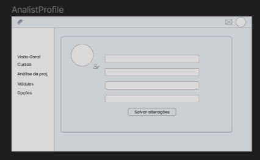

**Tela para análise de iniciativas**

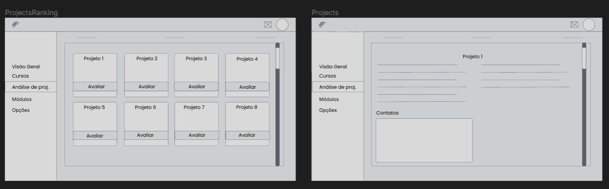

Seguindo para a parte de projetos, teremos uma tela própria para a visualização e análise das iniciativas enviadas pelos parceiros. Para analisar algum projeto basta clicar em cima dele e uma nova tela surgirá com todas as informaçoes e documentações, tanto da empresa quanto da iniciativa.

**Tela para visualização e criação de módulos**

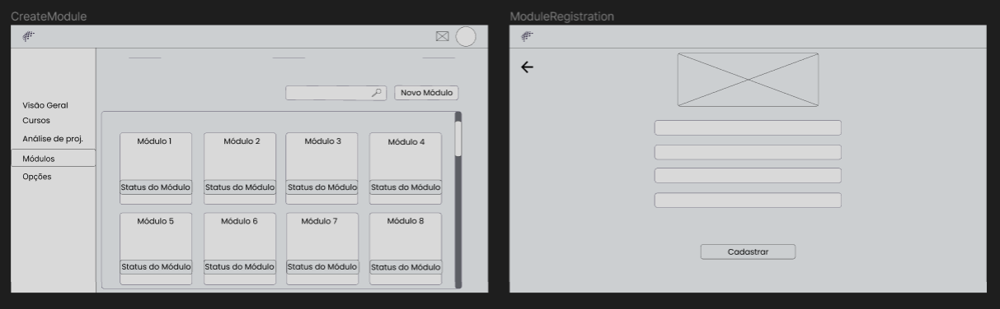

Na parte dos módulos temos uma visualização parecida com a de projetos, onde o analista consegue abrir o card e ver suas informações. Além disso ele tem a funcionalidade de criar um novo módulo clicando em "Novo Módulo", que o levará para uma parte de casdastro.


### 2.3.1 Design System

Um Design System pode ser definido como um repositório vivo, que contém uma coleção de componentes reutilizáveis e padronizados para um produto específico. Tem o objetivo de unificar a linguagem do produto, diminuir o retrabalho dos desenvolvedores e designers, até melhorar a padronização dos produtos, além de aprimorar a experiência de interação do usuário. Nesse projeto vamos desenvolver um estudo inicial de implementação de design system, com diretrizes claras e padronizadas, respeitando a marca do nosso parceiro e garantindo uma utilização flexível em diversos contextos. Baseado nisso segue nossa abordagem:

Clareza e Padronização das Telas e Informações: 

Cada tela foi projetada com um objetivo específico em mente. De forma que quando um usuário atinge aquela página ele saiba o que pode ser feito nela, como por exemplo no wireframe "cadastro de projetos" o parceiro vai saber que essa página é para fazer o cadastro de projetos.
Utilizaremos componentes consistentes com o dia-a-dia dos usuários para garantir o alinhamento dos elementos visuais em todas as páginas. Isto com o objetivo de melhorar facilitar a usabilidade da e eficiência da interação do usuário.

Mobilização e Incentivo à Colaboração através de Elementos Visuais:

Os botões de ação são destacados com cores vibrantes, guiando o usuário através de funções essenciais, como enviar propostas, recusar/aceitar projetos ou revisar o status do projeto.
Utilizamos ícones intuitivos ao lado das principais funções para facilitar o reconhecimento e acelerar a navegação.

Flexibilidade e adaptabilidade:
Com a necessidade de atender diferentes dispositivos de celulares, tablets e computadores, vamos criar páginas com layouts que se ajustam automaticamente a diferentes tamanhos de tela.
Elementos como menus suspensos e listas expansíveis foram implementados para otimizar o espaço na tela e adaptar-se a diferentes volumes de conteúdo.


Consistência com a marca do Parceiro:

Em cada elemento visual buscamos refletir a identidade da marca do nosso parceiro.
As cores escolhidas não só estão alinhadas com a marca do parceiro, mas também garantem legibilidade e acessibilidade. Além de ter sido escolhida a identidade visual já utilizada pelo parceiro que é o sistema de cards no site "Adalove".


# 3. Requisitos

Inclua nesta seção os requisitos funcionais e não funcionais da solução proposta.

Esta seção é importante porque permite que os desenvolvedores entendam claramente o que é esperado do software e quais serão as restrições e desafios enfrentados durante o desenvolvimento. Além disso, permite que os usuários finais saibam se o software atende às suas expectativas e se está adequado ao seu ambiente de trabalho.

Esta seção pode ser atualizada durante o ciclo de desenvolvimento do software, garantindo que todas as necessidades e especificações estejam sempre sendo consideradas.

## 3.1 Requisitos Funcionais

**Requisito Funcional 1:** Cadastro de iniciativas e possíveis parceiros

Descrição:

A funcionalidade de cadastrar iniciativas e possíveis parceiros será implementada para que os desenvolvedores e responsáveis pelo sistema possam analisar e alterar a situação do parceiro ou da iniciativa no banco de dados utilizado.

Descrição de Testes:

Pré-condição:

Para que a funcionalidade seja implementada, pressupõe-se que haja formulários na interface de usuários para que ele insira os dados necessários para o cadastro. Além disso, cada dado inserido no campo de input deve ter sua respectiva validação.

Procedimento de teste:

1. Acesse a interface de cadastro de iniciativas e possíveis parceiros.

2. Preencha os campos obrigatórios do formulário com dados válidos, incluindo informações relevantes sobre a iniciativa e os possíveis parceiros.

3. Pressione o botão de "Enviar" ou equivalente para submeter o formulário.

Resultado esperado:

Ao acionar a funcionalidade de cadastro:

- Os dados inseridos no formulário são processados e validados corretamente.
- Tanto a iniciativa quanto o possível parceiro são inseridos no banco de dados utilizado.
- Caso algum campo obrigatório não tenha sido preenchido ou os dados inseridos não passem na validação, o sistema exibirá mensagens de erro apropriadas.

Pós-condição:

Após o cadastro bem-sucedido:

- As informações da iniciativa e dos possíveis parceiros ficam armazenadas no banco de dados.
- A situação do parceiro ou da iniciativa pode ser analisada e alterada posteriormente pelos responsáveis do - sistema.
- O sistema pode exibir informações atualizadas sobre a iniciativa e os possíveis parceiros quando necessário.
- As informações de contato, status e outros detalhes relevantes podem ser visualizadas e modificadas conforme a necessidade.

**Requisito Funcional 2:** Alocação de parceiros nos projetos dentro do dash

​​Descrição:

A funcionalidade refere-se à implementação de uma tela na  interface visual, ou dashboard. Esse tela terá a finalidade de permitir a alocação eficiente de parceiros (empresas) aos projetos específicos, levando em consideração critérios como a compatibilidade dos projetos com os módulos abertos e as competências das empresas.

O critério de compatibilidade é realizado por meio da comparação dos atributos informados pelo parceiro face aos assuntos associados ao módulo cadastrado. Com a finalidade de que cada módulo receba uma iniciativa condizente com seus pré-requisitos.

Descrição de Testes:

Pré-condição:

- Certificar-se de que existem projetos abertos disponíveis para alocação.
- Garantir que empresas parceiras e seus representantes estejam cadastrados no sistema.
- Para que a funcionalidade seja implementada, precisamos ter a base das competências desejadas para a classificação de cada projeto.

Procedimento de teste:

Acesse o dashboard de alocação de parceiros.

1. Visualize a lista de projetos abertos.

2. Selecione um projeto específico para alocação.

3. Analise as informações detalhadas do projeto, incluindo descrição, compatibilidade com módulos e requisitos.

4. Selecione uma empresa parceira interessada no projeto.

5. Disparo de e-mail para empresa informando que foi selecionada com sucesso.

6. O projeto entra para um roadmap onde mostrará seu progresso.

Resultado esperado:

- A tela de alocação de parceiros é carregada sem erros.
- A lista de projetos abertos é exibida corretamente.
- Os detalhes do projeto selecionado são apresentados com precisão.
- As informações sobre a empresa parceira são mostradas com precisão.
- O email de confirmação é enviado ao parceiro com sucesso.
- O projeto entra na esteira de progresso sem erros.

Pós-condição:

- O sistema registra a alocação no projeto selecionado.
- A equipe de administração do sistema analisa a alocação feita.
- O representante da empresa parceira recebe uma confirmação de alocação por e-mail.

**Requisito Funcional 3:** Dash para analisar possíveis parceiros

​Descrição:

A funcionalidade em questão envolve a criação de uma tela na interface visual dedicada, com o propósito de capacitar os analistas do escritório de projetos a realizar análises de potenciais parceiros e determinar a viabilidade de estabelecer parcerias. Além disso, essa tela também fornecerá informações abrangentes sobre a iniciativa de projeto em consideração, proporcionando aos analistas os dados necessários para embasar suas decisões.

Descrição de Testes:

Pré-condição:

- Certificar-se de que os perfis das empresas parceiras e suas informações relevantes estão devidamente cadastrados no sistema.
- Ter projetos específicos que estejam em fase de avaliação para possível colaboração com parceiros.

Procedimento de teste:

Acesse o dashboard de análise de possíveis parceiros.

1. Visualize a lista de projetos em avaliação para parcerias.
2. Selecione um projeto específico para análise.
3. Explore as informações detalhadas do projeto em consideração, incluindo seus objetivos, requisitos técnicos e restrições.
4. Avalie as informações sobre as empresas parceiras disponíveis.
5. Avalie os riscos e benefícios potenciais de cada parceiro em relação ao projeto.
6. Tome uma decisão sobre a seleção do parceiro mais apropriado para o projeto em análise.

Resultado esperado:

- O dashboard de análise de possíveis parceiros é carregado sem erros.
- A lista de projetos em avaliação é exibida corretamente.
- Os detalhes do projeto selecionado são apresentados com precisão.
- As informações sobre as empresas parceiras são exibidas com precisão.
- As ferramentas de comparação permitem uma análise eficaz e intuitiva das opções de parceiros.
- A decisão sobre o parceiro selecionado é registrada de forma adequada.

Pós-condição:

- O sistema registra a seleção do parceiro para o projeto em análise.
- Os responsáveis pelo projeto e os envolvidos na tomada de decisão recebem notificações sobre a escolha do parceiro.
- As informações sobre a decisão são disponibilizadas para referência futura e acompanhamento.

### 3.1.1 Casos de Uso

Descreva os casos de uso da solução proposta. É importante entender que esta é uma parte importante da documentação do software pois descreve as suas funcionalidades e como elas serão utilizadas pelos usuários. Aqui, são listados todos os cenários possíveis de uso do software, incluindo as ações que o usuário pode realizar, as interações com o sistema e os resultados esperados. Os casos de uso devem ser descritos em detalhes, incluindo a descrição do objetivo da funcionalidade, as entradas de dados, as ações do usuário e os resultados esperados. Além disso, também devem ser incluídos os critérios de aceitação, que são os padrões que o software precisa atender para ser considerado como funcionando corretamente.

Os diagramas de caso de uso podem ser anexados aqui ou você pode adicionar o link para o drive (lembre-se de compartilhar com os professores). As User stories deverão ser escritas no Gut Huib Projects.

### Casos de Uso com Atores

(figura 10: Casos de uso)

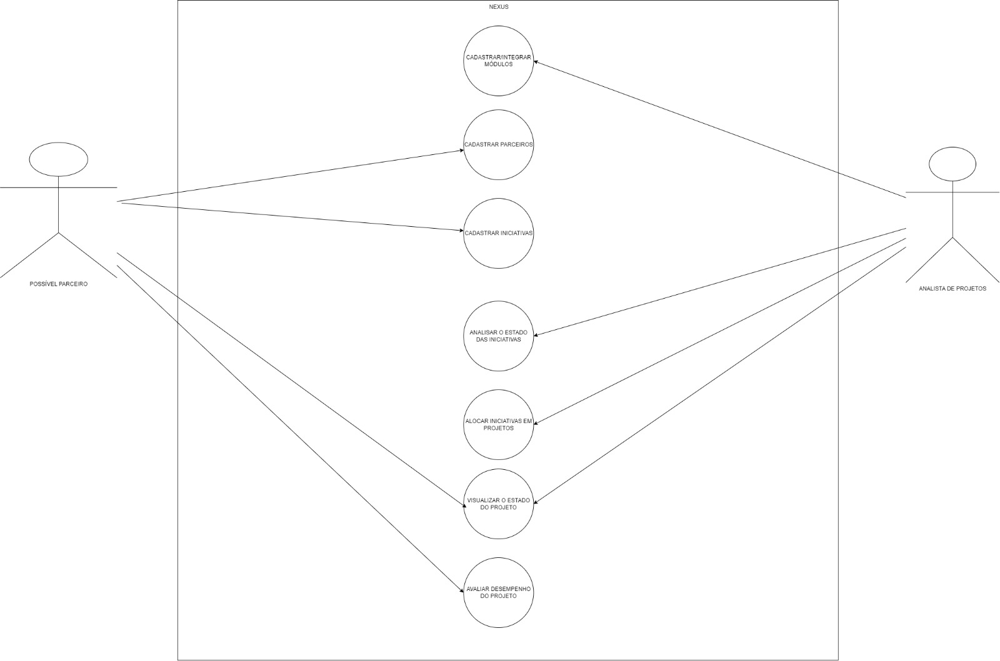

**fonte:** elaboração dos autores


Nesses casos de uso, todos os balões fazem referência aos requisitos funcionais que estão em contato com os atores do sistema, sendo eles:

**Cadastrar Novo Módulo:**

Descrição: Um analista de projetos pode cadastrar um novo módulo na plataforma, inserindo informações como título, descrição, requisitos, atividades e objetivos.

Entradas de Dados: Informações do módulo.

Ações do Usuário: O analista preenche os campos do formulário de cadastro.

Resultados Esperados: O módulo é registrado na plataforma com todas as informações inseridas.

Critérios de Aceitação: O módulo é exibido na lista de módulo cadastrados com os detalhes corretos.

**Cadastrar Empresa:**

Descrição: Empresas interessadas em participar de projetos podem se cadastrar na plataforma, fornecendo informações relevantes.

Entradas de Dados: Dados da empresa (nome, setor, área de atuação, etc.).

Ações do Usuário: Representante da empresa preenche o formulário de cadastro.

Resultados Esperados: A empresa é registrada na plataforma com as informações fornecidas.

Critérios de Aceitação: A empresa é exibida na lista de empresas cadastradas com os detalhes corretos.

**Cadastrar Novo Projeto:**

Descrição: Uma empresa parceira pode cadastrar uma nova iniciativa na plataforma, inserindo informações como título, descrição, requisitos e objetivos.

Entradas de Dados: Informações da iniciativa.

Ações do Usuário: A empresa preenche os campos do formulário de cadastro.

Resultados Esperados: A iniciativa é registrada na plataforma com todas as informações inseridas.

Critérios de Aceitação: A iniciativa é exibido na lista de iniciativas cadastradas com os detalhes corretos.

**Aprovar Proposta de Projeto:**

Descrição: Um analista de projetos recebe propostas de empresas e pode revisar e aprovar ou rejeitar cada proposta.

Entradas de Dados: Proposta de projeto.

Ações do Usuário: O analista avalia a proposta, podendo aprovar ou rejeitar com feedback.

Resultados Esperados: A proposta é marcada como aprovada ou rejeitada, com feedback se aplicável.

Critérios de Aceitação: A proposta é atualizada com o status correto e o feedback é registrado se rejeitada.

**Alocar Empresa a Projeto:**

Descrição: O analista de projetos alocará uma empresa a um projeto compatível com suas áreas de interesse.

Entradas de Dados: Projeto selecionado, empresa selecionada.

Ações do Usuário: O analista seleciona a empresa e o projeto, realiza a alocação.

Resultados Esperados: A empresa é alocada ao projeto e as informações são atualizadas na plataforma.

Critérios de Aceitação: A empresa é vinculada ao projeto escolhido e a alocação é feita corretamente.

**Acompanhar Progresso do Projeto:**

Descrição: Empresas e analistas podem acompanhar o progresso do projeto, visualizando etapas concluídas e pendentes.

Entradas de Dados: Projeto selecionado.

Ações do Usuário: O usuário acessa o painel de controle do projeto.

Resultados Esperados: O progresso do projeto é exibido com clareza, mostrando as etapas concluídas e as pendentes.

Critérios de Aceitação: As etapas são mostradas de forma precisa e o progresso é atualizado conforme as atividades são realizadas.

**Avaliar Desempenho do Projeto:**

Descrição: Empresas podem avaliar o desempenho do projeto ao final, fornecendo feedback e avaliações.

Entradas de Dados: Avaliação do projeto.

Ações do Usuário: A empresa fornece feedback e avaliações em diferentes critérios.

Resultados Esperados: A avaliação é registrada e pode ser visualizada pelo analista e pela instituição.

Critérios de Aceitação: A avaliação é registrada e as informações estão disponíveis para análise.


### Casos de Uso Independentes 

(figura 11: Casos de uso)

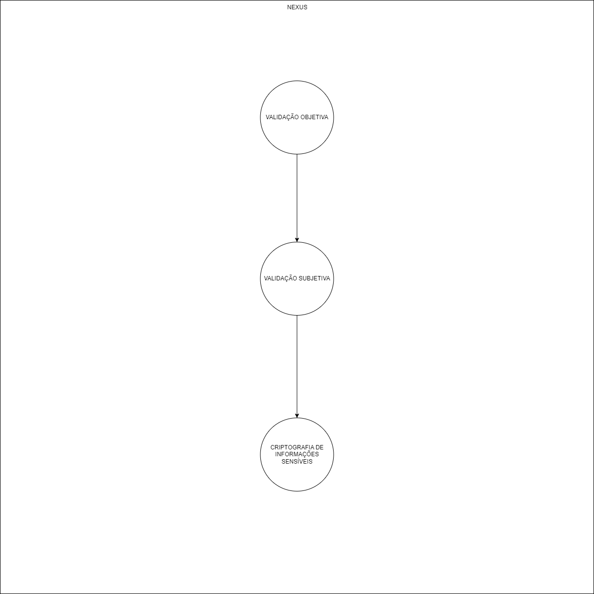

**fonte:** elaboração dos autores


Nesse esquema, há somente os requisitos não funcionais que aconteceram sem a necessidade de atuação dos atores.

### Diagrama de Implantação UML

(figura 12: Implantação UML)


**fonte:** elaboração dos autores


O diagrama de implantação UML ilustra uma comunicação tradicional entre o backend, servidor e frontend. Nele, é possível observar que a interface da aplicação estará no browser do usuário e será feita com React.js. Além disso, o código que rodará no servidor será feito com Nest.js, o framework do Node.js. Ambas as partes se comunicaram pelo protocolo HTTPS na porta 443. Em seguida, o código do servidor se comunicará pelo banco de dados relacional escolhido, o postgreSQL. Nele, a comunicação se dará por meio dos drivers do banco. Essas ferramentas foram escolhidas pois suportam todos os requisitos não funcionais do sistema. No Backend, o Nest.js consegue assegurar a segurança das informações sensíveis por meio da biblioteca bcrypt.js que usará criptografia avançada para proteção. Outrossim, por ser um framework de alta performance que faz o uso fiel de arquitetura limpa, ele consegue assegurar o bom funcionamento do algoritmo de matching. Por fim, a usabilidade será garantida pelo React.js com typescript, pois ele utilizará de componentes já prontos e validados pela empresa que mantém a biblioteca. Isso será feito por meio do material UI, que possui as interfaces para exportação e uso deliberado.

### 3.1.2 User Stories

Cada caso de uso descrito no item acima deverá ser detalhado no formato de User Story seguindo o formato abaixo:

Como PERFIL, DEVO/POSSO AÇÃO para OBJETIVO
PERFIL: perfil do usuário que realizará a ação
DEVO/POSSO: obrigatoriedade da ação
AÇÃO: o que será realizado
OBJETIVO: qual a finalidade da ação.

Exemplo:

    Eu, como analista de projetos, devo cadastrar um novo módulo de curso para uma disciplina para realizar a gestão e controle dos entregáveis.

## 3.2 Requisitos não funcionais

**Requisito Não Funcional 1:** Precisão no Algoritmo de Matching de Parceiros e Iniciativas 

Descrição: 

O sistema deve garantir a precisão do algoritmo de matching que compara as especificações dos possíveis parceiros com as das iniciativas. Isso implica que o algoritmo deve ser projetado e implementado de forma a identificar com exatidão a compatibilidade entre os parceiros e as iniciativas, de acordo com os critérios de matching estabelecidos.


Descrição de Testes:

Pré-condição:

Antes da realização dos testes, é necessário que o algoritmo de matching esteja devidamente integrado ao sistema, utilizando os critérios e especificações definidos para avaliar a compatibilidade.


Procedimento de teste: 

1. Selecione um conjunto de iniciativas e possíveis parceiros com características conhecidas e pré-determinadas.


2. Execute o algoritmo de matching para comparar as especificações dos parceiros com as das iniciativas selecionadas.


3. Analise os resultados fornecidos pelo algoritmo e verifique se eles correspondem às expectativas com base nas características conhecidas dos parceiros e iniciativas.


4. Repita o procedimento de teste com diferentes conjuntos de dados, incluindo casos de compatibilidade e não compatibilidade, para avaliar a consistência do algoritmo.


Resultado esperado:

Ao realizar o procedimento de teste:

- O algoritmo de matching deve identificar corretamente a compatibilidade entre parceiros e iniciativas de acordo com as características conhecidas.
- Nos casos de compatibilidade, o algoritmo deve indicar uma alta probabilidade de match e o valor obtido na escala INTELI de classificação dos projetos.
- Nos casos de não compatibilidade, o algoritmo não deve indicar uma falsa compatibilidade e também apresentar o valor obtido na classificação.
- O algoritmo deve fornecer resultados consistentes e confiáveis em diferentes cenários de teste.


Pós-condição:

Após o teste bem-sucedido:

- O algoritmo de matching é considerado preciso e confiável na avaliação da compatibilidade entre parceiros e iniciativas.
- Os responsáveis pelo sistema podem confiar nos resultados do algoritmo para selecionar os melhores parceiros para cada iniciativa.
- O sistema está pronto para fornecer recomendações precisas com base nas especificações do parceiro e do projeto, contribuindo para a eficácia das parcerias estabelecidas.


**Requisito Não Funcional 2:** Segurança dos dados sensíveis (ISO25010) 

Descrição: 

A plataforma deve garantir a confidencialidade das informações inseridas, usando criptografia e outros métodos de proteção contra acesso não autorizado. 

Descrição de Testes: 

Pré Condição: A plataforma está configurada e instalada corretamente. 

Procedimento de teste:

- Tentar acessar áreas restritas sem autenticação adequada.

Resultado esperado:

- O acesso é negado e o sistema registra a tentativa de violação. 

Pós Condição:

- Informações permanecem seguras e tentativas de violação são documentadas.

**Requisito Não Funcional 3:** Usabilidade para o público alvo (ISO25010) 

Descrição: 

A plataforma deve ter uma interface acessível aos mais variados grupos, que seja de fácil utilização e entendimento sendo apropriado às necessidades do cliente, tendo atributos que facilitam seu uso e protegendo o usuário do erro.

Descrição de Testes: 

Pré Condição:

- O UX só pode ser criado caso exista alguma métrica de teste que avalie quão acessível e intuitiva a plataforma é. Assim como colete feedback de usuários para que consiga se realizar um sistema que evite o erro do usuário. 

Procedimento de teste: 

- Coletar feedback de usuários e observar as métricas captadas que definem sucesso da acessibilidade e quão intuitiva a plataforma é.

Resultado esperado: 

- Os feedbacks são majoritariamente positivos, existindo ajustes para os negativos e as métricas são extremamente positivas.

Pós Condição: 

-Conforme recebem mais feedbacks a plataforma é atualizada. Assim como incluem-se mais métricas de avaliação.


# 4. Arquitetura do Sistema

Descreva a arquitetura da sua solução. A arquitetura de um sistema de software é uma descrição abrangente da estrutura e organização de uma solução tecnológica (software e hardware), incluindo seus componentes, relacionamentos, interfaces, padrões de comunicação e fluxo de dados. Ela fornece uma visão de alto nível da solução e define a maneira como os diferentes elementos se conectam e interagem para atender aos requisitos do sistema.

## 4.1. Diagrama de Arquitetura

Atualizar a cada revisão/atualização da arquitetura, mantendo todas as versões no documento.

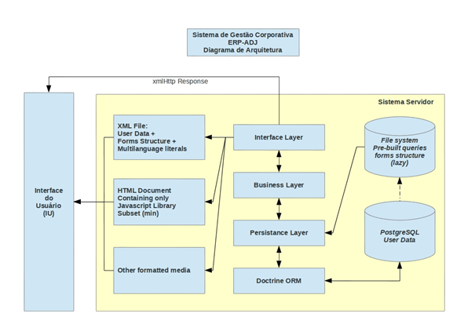

Exemplo de Diagrama de Arquitetura

## 4.2. Diagrama de Implantação

Crie um diagrama de implantação do projeto com a solução proposta. O diagrama deverá descrever onde os módulos do sistema estarão implantados e os protocolos de comunicação utilizados entre eles. Inclua uma descrição textual completa do diagrama, e que mostra como requisitos não funcionais são suportados.

### 4.2.1. Componentes que compões a solução

## Tecnologias e Ferramentas Utilizadas
Neste projeto, foi utilizada uma combinação de tecnologias e ferramentas para alcançar a máxima eficiência e funcionalidades de desenvolvimento. Criamos a estrutura inspirada na teoria de arquitetura limpa, metodologia proposta por Robert C. Martin que promove a separação de preocupações e a desacoplação das regras de negócio da infraestrutura e da interface do usuário.
## Backend
### Nest.JS
- **Descrição**: O Nest.JS é um framework para construção de aplicações pelo lado do servidor em Node.js eficientes e escaláveis. Ele utiliza TypeScript, que é um superconjunto de JavaScript, e combina elementos de OOP (Programação Orientada a Objetos), FP (Programação Funcional) e FRP (Programação Reativa Funcional).
- **Utilização no Projeto**: No nosso projeto, o Nest.JS foi empregado para ajudar na estruturação da arquiterura limpa no backend, fornecendo uma base sólida e escalável para criação de endpoints e regras de negócios.
### Docker
- **Descrição**: O Docker é uma plataforma que permite desenvolvedores criar, executar e empacotar aplicações dentro de contêineres. Estes contêineres são ambientes leves, isolados e consistentes, facilitando o desenvolvimento.
- **Utilização no Projeto**: Utilizamos Docker para encapsular nossa aplicação e suas dependências em um contêiner. Isso simplificou o processo de deploy, assegurou consistência entre ambientes de desenvolvimento, teste e produção e facilitou a escalabilidade e distribuição do nosso serviço.
### Prisma
- **Descrição**: A ferramenta de banco de dados ORM (Object-Relational Mapping) que simplifica a interação com bancos de dados será utilizada para mapear as entidades do banco e transforma-las em objetos para facilitar o manuseio na aplicação backend.
- **Utilização no projeto**: O Prisma foi definida como a tecnologia que irá intermediar e facilitar a nossa interação com o banco de dados usando um contrutor de queries seguro e auto-gerado. Também promove boas práticas como segurança de tipo e controle de versão de esquema.
## Frontend
### HTML
- **Descrição**: O HTML (HyperText Markup Language) é a linguagem padrão para criar e projetar páginas web. Ele define a estrutura e o conteúdo de uma página, como cabeçalhos, parágrafos, imagens e links.
- **Utilização no Projeto**: Utilizamos HTML como base para estruturar todos os componentes visuais da nossa aplicação web. Ele define a espinha dorsal da interface, sobre a qual estilos e comportamentos são aplicados.
### CSS
- **Descrição**: O CSS (Cascading Style Sheets) é uma linguagem utilizada para descrever a apresentação de documentos escritos em HTML. Ele é responsável por estilizar a página, definindo propriedades como cores, espaçamentos, fontes e animações.
- **Utilização no Projeto**: Usamos CSS para estilizar e personalizar a aparência da nossa aplicação. Garantindo uma estética mais agradável e responsiva.
### React
- **Descrição**: Biblioteca JavaScript para construir interfaces de usuário. Ele permite criar componentes reutilizáveis e gerenciar o estado da aplicação de forma eficaz.
- **Utilização no Projeto**: Usamos o React para desenvolver a interface de usuário do nosso serviço. Com ele, criamos uma UI responsiva e interativa que se comunica com nosso backend.
### Vite
- **Descrição**: Ferramenta de desenvolvimento rápida para criação de aplicações web modernas com JavaScript e TypeScript. Ele foi criado para ser um "bundler" (empacotador) e "dev server" (servidor de desenvolvimento) extremamente rápido e eficiente, otimizado para o desenvolvimento de aplicativos modernos na web.
- **Utilização no Projeto**: Foi utilizado com o intuito de acelerar o processo de desenvolvimento em TypeScript do nosso projeto.
## Cloud e Deploy
### Amazon AWS
- **Descrição**: A Amazon Web Services (AWS) é uma plataforma de serviços em nuvem que oferece uma variedade de infraestruturas, como computação, armazenamento e até mesmo soluções de aprendizado de máquina.
- **Utilização no Projeto**: Utilizamos a AWS como plataforma de infraestrutura para hospedar e gerenciar os serviços e recursos associados ao nosso projeto, no caso o Amazon EC2.
### Amazon EC2
- **Descrição**: Amazon EC2 (Elastic Compute Cloud) é um serviço web que oferece capacidade computacional escalável na nuvem. Ele permite executar instâncias e gerenciar servidores de forma eficiente.
- **Utilização no Projeto**: Para garantir que nosso serviço seja facilmente acessível, nós o implantamos no Amazon EC2. Com isso, garantimos escalabilidade e alta disponibilidade para os usuários.
### Amazon RDS
- **Descrição**: O Amazon Relational Database Service (Amazon RDS) é um serviço de banco de dados relacional totalmente gerenciado oferecido pela Amazon Web Services (AWS). Ele foi projetado para facilitar a implantação, gerenciamento e escalabilidade de bancos de dados relacionais na nuvem. O Amazon RDS suporta vários motores de banco de dados populares, incluindo: MySQL, PostgreSQL, Oracle, Microsoft SQL Server, MariaDB e Amazon Aurora.
- **Utilização no projeto**: Foi necessário para funcionar como o nosso banco de dados em nuvem, ou seja, os dados serão guardados e gerenciados pelo RDS que estará configurado para trabalhar dentro de uma instância do EC2.
### GitHub
- **Descrição**: O GitHub é uma plataforma de desenvolvimento colaborativo. Ele fornece hospedagem para software de controle de versão usando git.
- **Utilização no Projeto**: Usamos o GitHub para versionamento e hospedagem do código-fonte do projeto.
## Testes
### Postman
- **Descrição**: O Postman é uma plataforma para testar, documentar e monitorar APIs.
- **Utilização no Projeto**: Utilizamos o Postman para testar os endpoints do nosso backend. Ele nos permitiu rapidamente verificar a corretude das respostas do nosso serviço, simular diferentes cenários de entrada e garantir que todas as funcionalidades estavam operando conforme especificado.

### 4.2.2. Procedimentos de implantação da solução
 
#### 4.2.2.1 Backend mock

Primeiramente, é importante entender o que é um backend mockado, sendo ele um simulacro que imita o comportamento de um sistema real, mas não se comunica com nenhum banco de dados. A partir dessa definição, é possível afirmar que o backend mockado é perfeito para testar aplicações frontend antes que o backend esteja completamente pronto. 
Adicionalmente, é importante que existam certos requisitos ao fazer um backend mockado, sendo a principal deles a definição de cenários de teste ou casos de uso para os quais comportamento do backend será simulado. Isso pode incluir diferentes tipos de solicitações, respostas, códigos de status, cenários de erro, etc. <br>

#### 4.2.2.2 Processo de deploy

Foi realizado o deploy utilizando a aws por meio de um serviço chamado ec2 (elastic computing cloud), nela será adicionado primeiro uma API que se conecta com a interface de usuário e em outra máquina ec2 haverá a inserção do frontend.
Além da AWS, foi utilizado o Docker, que é uma plataforma para empacotar, distribuir e executar aplicativos em contêineres, garantindo isolamento, portabilidade e consistência. Agilizando o desenvolvimento, implantação e gerenciamento da aplicação.
cada parte do sistema (frontend e backend) está em um container, onde ao invés de subir a aplicação espalhada sobe-se apenas os containers. <br>

Passo a passo para o deploy: <br>
1. Conexão SSH via private key localizado na pasta keys <br>
2. Clonar o repositório que possui a aplicação nexus <br>
3. Navegar até o respectivo arquivo frontend ou backend <br>
4. instalar as dependências do node, utilizando o comando ```npm i``` <br>
6. Para rodar a aplicação utilizando o comando ```npm run dev``` caso seja o frontend ou ```npm run start: dev``` caso seja a API <br>

### 4.2.2.3 Demonstração de Integração

Link para o vídeo de demonstração de integração entre backend mock e o frontend:
https://drive.google.com/file/d/1QqprpwinmxsQpFNSYl0Sayd1gYtI2R2Y/view?usp=drive_link

Link para o vídeo de demonstração de integração mostrando testes de integração entre o backend mock e o frontend:
https://drive.google.com/file/d/1bSLa4tZPu6ho0WWHazfECfDzpLOByzLv/view?usp=drive_link

## 4.3. Diagrama de Sequência

Crie diagramas de sequência UML mostrando a integração entre frontend e backend. Descreva as sequências de diagramas encadeando explicações que relacionam a sequência apresentada. Isso serve para contextualizar a leitura pela parte interessada.

### Alocar Iniciativas em um projeto:
O diagrama de sequência se inicia com um "Analista de Projeto", que é um ator neste cenário, e deseja alocar uma turma específica em uma iniciativa. As principais entidades e componentes envolvidos são: Interface (frontend em React), entidades de Módulo, Iniciativa e Turma, e um EC2 AWS que funciona como servidor e simula o backend.

.png>)

**fonte:** elaboração dos autores

### 1. Login do Analista de Projeto:
- O Analista de Projeto começa digitando sua senha e clicando para fazer login.
- A Interface (React) faz uma requisição POST (HTTP) para autenticar o usuário.
- O EC2 AWS (Backend Mock) processa a requisição e responde com um status de autenticação.
- Dependendo da resposta do servidor, a Interface apresentará uma mensagem indicando se o acesso foi "Liberado" ou "Negado".
### 2. Acessando Análise de Projetos:
- Após o login bem-sucedido, o Analista de Projeto clica na opção "análise de projetos".
- A Interface realiza uma requisição GET (HTTP) para obter informações da entidade "turma".
- O EC2 AWS (Backend Mock) responde retornando todas as turmas disponíveis.
- A Interface atualiza e mostra todas as turmas para o Analista de Projeto.
### 3. Selecionando a Turma de Interesse:
- O Analista de Projeto seleciona uma turma específica de seu interesse.
- A Interface faz uma requisição GET (HTTP) referente à turma escolhida. Esta turma tem um ID associado à entidade "módulo", que, por sua vez, está ligado a várias linhas da entidade "iniciativa".
- O EC2 AWS (Backend Mock) responde retornando informações da turma, do módulo associado e das possíveis iniciativas vinculadas.
- A Interface atualiza e mostra todas as informações relevantes para o Analista de Projeto.
### 4. Alocando a Turma:
- O Analista de Projeto opta por "Alocar Turma" à iniciativa.
- A Interface executa uma requisição UPDATE (HTTP) para que aquela turma específica seja vinculada a uma linha da entidade "iniciativa".
- O EC2 AWS (Backend Mock) processa essa atualização e confirma a mudança nas entidades envolvidas.
- A Interface mostra uma mensagem ao Analista de Projeto informando "Turma Alocada com Sucesso".
- Finalmente, a Interface retorna à página principal da turma.

### Cadastro de Iniciativas:
O diagrama de sequência descreve o processo pelo qual um "Parceiro" deseja enviar uma iniciativa para um módulo específico. Os principais elementos envolvidos neste cenário são: Interface (frontend em React), e as entidades de Módulo, Iniciativa e Turma. O EC2 AWS serve como mock do backend.

.png>)

**fonte:** elaboração dos autores


### 1. Login do Parceiro:
- O Parceiro começa digitando sua senha e clicando para fazer login.
- A Interface (React) faz uma requisição POST (HTTP) para autenticar o Parceiro.
- O EC2 AWS (Backend Mock) processa a requisição e responde com um status de autenticação.
- Dependendo da resposta do servidor, a Interface apresentará uma mensagem informando se o acesso foi "Liberado" ou "Negado".
### 2. Preenchimento de Informações:
- Após autenticação bem-sucedida, a Interface é atualizada para permitir que o Parceiro preencha os detalhes da iniciativa.
- O Parceiro completa todas as informações necessárias no formulário e, em seguida, clica em "Cadastrar".
### 3. Cadastrando a Iniciativa:
- A Interface realiza uma requisição POST (HTTP) para criar uma nova entrada na entidade "iniciativa".
- O EC2 AWS (Backend Mock) processa a requisição, criando um novo registro na entidade Iniciativa.
- A Interface é atualizada, direcionando o Parceiro de volta ao seu feed.

### Cadastro de Parceiro:
Este diagrama de sequência descreve o processo de cadastro de um novo "Parceiro" na plataforma. Os principais elementos envolvidos são: Interface (frontend em React) e a Parceiro. O EC2 AWS funciona como mock do backend.

.png>)

**fonte:** elaboração dos autores

### 1. Acessando o Cadastro:
- O Parceiro acessa a página de cadastro na plataforma.
- A Interface (React) apresenta o formulário para inserção das informações do Parceiro.
### 2. Preenchimento de Informações:
- O Parceiro preenche as informações necessárias, como nome, email, senha, entre outras.
- Após preencher, o Parceiro clica em "Cadastrar".
### 3. Envio de Informações para Cadastro:
- A Interface envia os dados preenchidos através de uma requisição POST (HTTP) para registrar o novo Parceiro.
- O EC2 AWS (Backend Mock) processa a requisição e registra o novo Parceiro na base de dados.
- O EC2 AWS (Backend Mock) envia uma resposta de sucesso ou falha de acordo com o resultado do registro.
- A Interface exibe a mensagem correspondente ao status do registro, podendo ser "Cadastro realizado com sucesso" ou "Erro ao realizar cadastro".

Segue link para acesso ao lucid app com diagrama UML: https://lucid.app/lucidchart/6cd5d5b6-c768-45dc-9e35-2b38e7474fc9/edit?viewport_l[…]Ldq~84CkD7&invitationId=inv_c2b03551-d0f6-4a26-8bba-816ba2b8be7d


## 4.4. Backend com Banco de Dados

Neste documento, você encontrará detalhes sobre as operações CRUD, o procedimento de deploy do banco de dados na AWS e evidências de nossas implementações.

## Operações CRUD

Com base no modelo conceitual e lógico apresentado anteriormente, as seguintes operações CRUD foram implementadas:

### Create

1. **Analista de Projetos (Analyst)**

```
  findAll: Prisma.sql`
    SELECT * FROM "Analyst"
    WHERE "isActive" = true;
    `,
    create: (analystDto: AnalystDto): Sql => Prisma.sql`
    INSERT INTO "Analyst" (
        "id",
        "name",
        "password",
        "email",
        "role",
        "isActive",
        "updatedAt"
    )
    VALUES (
        ${uuid.v4()},
        ${analystDto.name},
        ${analystDto.password},
        ${analystDto.email},
        ${analystDto.role},
        ${true},
        ${new Date()}
    )
    RETURNING *;
    `,

```
  
2. **Iniciativa (Initiative)**

```
  findAllInitiativesAndModules: Prisma.sql`
    SELECT
    module.moduleName AS module_name,
    initiative.initiativeName AS initiative_name,
    module.status AS module_status
  FROM
    Module AS module
  INNER JOIN
    Initiative AS initiative ON module.id = initiative.module_id;
    `,

  create: (iniativeDto: InitiativeDto): Sql => Prisma.sql`
    INSERT INTO "Initiative" (
      "id",
      "initiativeName",
      "scope",
      "partnerId",
      "moduleId",
      "courseId,
      "isActive",
      "updatedAt"
  )
  VALUES (
      ${uuid.v4()},
      ${iniativeDto.initiativeName},
      ${iniativeDto.scope},
      ${iniativeDto.partnerId},
      ${iniativeDto.moduleId},
      ${iniativeDto.courseId},
      ${true},
      ${new Date()}
  )
  RETURNING *; `,

  findAll: Prisma.sql`
  SELECT * FROM "Initiative"
  WHERE "isActive" = true 
  `

```
3. **Modulo (Module)**

```
    create: (moduleDto: ModuleDto): Sql => Prisma.sql
        INSERT INTO "Module" ("id", "courseCode", "moduleName", "beginData", "isActive", "createdAt", "updatedAt", "status")
        VALUES (
            ${uuid.v4()},
            ${moduleDto.courseCode},
            ${moduleDto.moduleName},
            ${new Date()},
            ${moduleDto.isActive},
            ${new Date()},
            ${new Date()},
            ${moduleDto.status}
        )
        RETURNING *;
    `,
```

4. **Parceiro (Partner)**
```
  findAll: Prisma.sql`
    SELECT * FROM "Partner"
    WHERE "isActive" = true;
  `,
  create: (partnerDto: PartnerDto): Sql => Prisma.sql`
  INSERT INTO "Partner" ("id", "partnerName", "sector", "contactEmail", "contactPhone","branch", "representativeJob", "isActive", "responsibleName", "password", "updatedAt")
  VALUES (
    ${uuid.v4()}, 
    ${partnerDto.partnerName}, 
    ${partnerDto.sector}, 
    ${partnerDto.contactEmail}, 
    ${partnerDto.contactPhone}, 
    ${partnerDto.branch}, 
    ${partnerDto.representativeJob},
    ${true},
    ${partnerDto.responsibleName},
    ${partnerDto.password},
    ${new Date()}
  )
  RETURNING *;

```

### Read

1. **Parceiro (Partner)**
   - Buscar parceiro por ID. Usapa vizualisar as informações de um parceiro
  ```
   SELECT * FROM Partner WHERE id = ...;
  ```

2. **Iniciativa (Initiative)**
  - Buscar iniciativa por ID.
```
  SELECT * FROM Initiative WHERE id = ...;
```
  - Buscar iniciativas assossiadas a um parceiro específico.
```
  SELECT * FROM Initiative WHERE partnerId = ...;
```
  - Listar iniciativas ativas.
```
  SELECT * FROM Initiative WHERE isActive = TRUE;
```
3. **Módulo (Module)**
  - Buscar módulo por ID.
  ```
  SELECT * FROM Module WHERE id = ...;
  ```

  - Buscar módulos associados a um curso específico.

  ```
  SELECT * FROM Module WHERE courseId = ...;
  ```
  - Listar módulos ativos
  ```
  SELECT * FROM Module WHERE isActive = TRUE;
  ```

### Update

1. **Parceiro (Partner)**
  - Atualizar nome do parceiro por ID.
  ```
  UPDATE Partner SET partnerName = '...' WHERE id = ...;
  ```

2. **Iniciativa (Initiative)**
  - Atualizar nome da iniciativa por ID.
  ```
  UPDATE Initiative SET initiativeName = '...' WHERE id = ...
  ```

3. **Módulo (Module)**
  - Atualizar nome do módulo por ID.
  ```
  UPDATE Module SET moduleName = '...' WHERE id = ...;
  ```

### Delete

1. **Iniciativa (Initiative)**
  - Deletar iniciativa por ID.
  ```
  DELETE FROM Initiative WHERE id = ...;
  ```

## Procedimento de Deploy na AWS  

### Setup da Instância EC2 na AWS

1. Acesse a AWS Management Console e vá até o serviço EC2.
2. Clique no botão `Launch Instance` para criar uma nova instância.
3. Selecione a Amazon Machine Image (AMI) desejada, como por exemplo, "Linuz".
4. Escolha o tipo de instância no nosso caso foi `t2.micro`.
5. Configuração dos detalhes da instância, adicionando ao security group uma regra para permitir o tráfego na porta 80 (HTTP) e 443 (HTTPS), bem como quaisquer outras portas que forem necessárias.
6. Inicie a instância e anote o endereço IP público ou o nome de domínio público.

### Setup do banco de dados na AWS

1. Selecione a opção "Criar banco de dados"
2. Na página Criar banco de dados, escolha Criação padrão.
3. Para opções de mecanismo, escolha MySQL.
4. Para Modelos, escolha Nível gratuito.
5. Na seção Disponibilidade e durabilidade, mantenha os padrões.
6. Na seção Configurações, defina estes valores:
    Identificador de instância de banco de dados – digite tutorial-db-instance.
    Nome de usuário mestre – digite tutorial_user.
    Gerar senha automaticamente – Deixe a opção desativada.
    Senha mestra – Digite uma senha.
    Confirmar senha – Digite novamente a senha.
7. Na seção Configuração da instância, defina estes valores:
    Classes expansíveis (inclui classes t)
    db.t3.micro
8. Na seção Armazenamento, mantenha os padrões.
9. Na seção Conectividade, defina estes valores e mantenha os outros valores como padrão:
    Em Recurso de computação, escolha Conectar-se a um recurso de computação do EC2.
    Para instância EC2, escolha a instância EC2 que você criou anteriormente, como tutorial-ec2-instance-web-server.
10. Na seção Autenticação de banco de dados, certifique-se de que Autenticação por senha esteja selecionada.
11. Abra a seção Configuração adicional e insira amostra para Nome inicial do banco de dados. Mantenha as configurações padrão para as outras opções.
12. Para criar sua instância de banco de dados Postgre, escolha Criar banco de dados.

### Iniciando deploy

1. Iniciar uma instância EC2 com o comando:
    
    ssh -i nomechave  ec2-user@Public IPv4 DNS

2. Instalando Git com o seguinte comando:
    
    sudo apt install git -y

3. Instalando Docker:

    sudo apt install apt-transport-https ca-certificates curl software-properties-common
    curl -fsSL https://download.docker.com/linux/ubuntu/gpg | sudo apt-key add -
    sudo add-apt-repository "deb [arch=amd64] https://download.docker.com/linux/ubuntu $(lsb_release -cs) stable"
    sudo apt update
    sudo apt install docker-ce -y

4. Instalando Docker Compose:

    sudo curl -L "https://github.com/docker/compose/releases/download/1.29.2/docker-compose-$(uname -s)-$(uname -m)" -o /usr/local/bin/docker-compose
    sudo chmod +x /usr/local/bin/docker-compose

5. Clonando seu repositório Git

    git clone url
    cd your-repository-name/

6. Buildar imagem para o backend na raiz do backend, no nosso caso 'nexus-api'
    docker build -t nexus-backend-image .

7. Rodar container 

    docker run -p 8080:8080 nexus-backend-image

8. Buildar imagem para o frontend na raiz do projeto, no nosso caso 'frontend'
    docker build -t nexus-frontend-image .

9. Rodar container 

    docker run -p 8080:8080 nexus-frontend-image

# 5. Projeto e Implementação UX e UI

## Design e Funcionalidade da Aplicação

### Wireframe e Design Inicial:

Durante a fase de desenho do wireframe, o foco principal foi criar uma estrutura que fosse fácil de usar e intuitiva para os usuários. Cada elemento da interface foi cuidadosamente planejado para promover uma experiência positiva. Os principais princípios de design que orientaram essa fase foram a clareza, consistência e simplicidade.

**1. Navegação Simplificada:**
Foram delineados os principais fluxos de navegação, com menus bem definidos e categorizados. A barra de navegação lateral concentra-se nas áreas essenciais do sistema, com rótulos claros para indicar a função de cada seção.

**2. Ícones Intuitivos:**
Os ícones foram escolhidos com base em sua capacidade de serem facilmente compreendidos pelos usuários. Ícones padronizados do Design System foram usados para manter a consistência visual e facilitar o reconhecimento.

**3. Layout Responsivo:**
Desde o início, a preocupação com a acessibilidade foi incorporada ao design. O layout foi planejado para se adaptar a diferentes dispositivos e tamanhos de tela, garantindo uma experiência consistente em todos os contextos.

**4. Fluxos de Tarefas:**
Os fluxos de tarefas mais comuns foram mapeados para garantir que a jornada do usuário fosse otimizada. Os menus, elementos de input e cartões de formulário por exemplo, foram preenchidos com textos autoexplicativos que focam na garantia de compreensão de uso do sistema por parte dos usuários.

### Desenvolvimento Frontend:

Com base no design inicial, o desenvolvimento frontend concentrou-se em trazer à vida as funcionalidades e características planejadas.

**1. Botões e Menus Interativos:**
Os botões foram estilizados de acordo com o Design System, com feedback visual ao passar o cursor sobre eles. Menus suspensos foram implementados de forma a exibir as opções de maneira organizada e agradável.

**2. Interação com Ícones:**
Ícones foram incorporados nos fluxos de forma a auxiliar na identificação rápida das ações. Ao clicar em uma iniciativa que tem um ícone de "Aprovado", por exemplo, uma tela é apresentada com um design coeso.

**3. Responsividade e Acessibilidade:**
O desenvolvimento frontend garantiu que a aplicação se adaptasse perfeitamente a diferentes dispositivos e resoluções. A atenção à acessibilidade resultou em tamanhos de fonte legíveis, alto contraste e feedback de uso do sistema.

**4. Passos para Tarefas:**
Os fluxos mapeados durante o design foram implementados, com passos claros apresentados de forma sequencial. Em um fluxo de inscrição, por exemplo, os usuários inserem dados em etapas distintas antes de finalizar o processo.

**5. Validação e Feedback:**
A interface foi projetada para fornecer feedback imediato aos usuários. Se um campo obrigatório não for preenchido, uma mensagem de validação é exibida ao lado, orientando o usuário sobre o que é necessário.

**6. Perfis de Usuário Diversificados:**
Considerando a variedade de usuários, como aqueles com habilidades limitadas, recursos diferentes ou necessidades especiais, foram implementadas alterações de layout que visam a acessibilidade, como alteração da disposição dos itens em telas diferentes ou quando o zoom for aumentado e diminuído.

***A aplicação foi projetada e desenvolvida com uma abordagem centrada no usuário, tendo em mente a clareza, a acessibilidade e a facilidade de uso. Desde a concepção do wireframe até o desenvolvimento frontend, a intenção foi criar uma interface que atendesse às necessidades variadas dos usuários, proporcionando uma experiência consistente, intuitiva e agradável.***


## 5.1. Frontend

**No desenvolvimento do frontend da plataforma, foram utilizadas as seguintes tecnologias: React, Typescript, Tailwind CSS, CSS e HTML.**

**Telas Desenvolvidas e Fluxo de Navegação:**

1. **Tela de Login:**
   - Opções para inserir e-mail e senha para efetuar o login.
   - Opção de cadastro para novos usuários.
   - Fluxo de navegação: Tela de login -> Visão Geral (após autenticação).

2. **Tela de Cadastro:**
   - Formulário para preencher informações de novo usuário.
   - Opção para criar uma conta após preencher os campos.
   - Fluxo de navegação: Tela de Cadastro -> Tela de Login (após o cadastro ser bem-sucedido).

3. **Tela de Visão Geral:**
   - Visão geral das atividades e projetos do usuário.
   - Fluxo de navegação: Visão Geral -> Tela de Cursos (clicando em um curso).

4. **Tela de Cursos:**
   - Lista de projetos alocados em cursos específicos.
   - Botão para visualizar os detalhes do projeto alocado.
   - Fluxo de navegação: Tela de Cursos -> Tela de Detalhes do Projeto (clicando em um projeto).

5. **Tela de Detalhes do Projeto:**
   - Detalhes completos de um projeto específico.
   - Informações sobre o projeto, suas partes envolvidas e status.
   - Fluxo de navegação: Tela de Detalhes do Projeto -> Tela de Cursos (botão de retorno).

6. **Tela de Iniciativas:**
   - Conjunto de iniciativas com status de Aprovado, Para Análise ou Negado.
   - Fluxo de navegação: Tela de Iniciativas -> Tela de Detalhes da Iniciativa (clicando em uma iniciativa).

7. **Tela de Detalhes da Iniciativa:**
   - Detalhes da iniciativa enviada pelo parceiro que será analisada.
   - Informações sobre a iniciativa, envolvidos e status.
   - Fluxo de navegação: Tela de Detalhes da Iniciativa -> Tela de Iniciativas (botão de retorno).

8. **Tela de Alocação:**
   - Tela onde os analistas de projetos podem alocar iniciativas aprovadas.
   - Lista de iniciativas alocadas e opção para confirmar alocação.
   - Fluxo de navegação: Tela de Alocação -> Tela de Detalhes da Iniciativa (clicando em uma iniciativa alocada).

**Observações sobre a Implementação:**

- Para melhorar a usabilidade, a tela de Cadastro foi projetada de forma a orientar os usuários passo a passo, destacando os campos obrigatórios e fornecendo feedback imediato em caso de erro.
- As telas de Detalhes do Projeto e Detalhes da Iniciativa foram enriquecidas com seções adicionais para exibir mais informações relevantes.
- Em relação ao protótipo de baixa fidelidade, foi necessária uma reorganização dos elementos nas telas de Cursos e Iniciativas para tornar a informação mais visível, especialmente quando há muitos itens.
- Na tela de Alocação, um sistema de arrastar e soltar foi implementado para facilitar a alocação de iniciativas aos projetos.
- A tela de Alocação também inclui botões de ação claros para confirmar alocação ou cancelar ação.

**Resumo:**

O fluxo de navegação conecta todas as telas de forma coesa, permitindo aos usuários explorar projetos, iniciativas, detalhes e fazer alocações conforme necessário. Mudanças e ajustes foram feitos durante a implementação para melhorar a usabilidade e a visibilidade das informações. A atenção às interações do usuário e às diferentes etapas do processo resultou em uma experiência consistente e intuitiva, que atende às necessidades do projeto e dos usuários. O design das telas reflete o design inicial e mantém os princípios de usabilidade e acessibilidade em foco.

# 6. Projeto de Banco de Dados

Descreva os modelos conceituais e lógicos propostos para a definição do Banco de Dados.

## 6.1. Modelo Conceitual

### Entidades e suas respectivas descrições:

#### Parceiro (Partner)
**Conceito:** Representa as empresas ou indivíduos que estão propondo projetos para serem realizados em colaboração com os estudantes.

**Atributos:** ID, Nome do Parceiro, Setor, E-mail de Contato, Telefone de Contato, Taxa pelo Projeto, Ramo, Cargo do Representante, Está Ativo?, Data de Criação, Data de Atualização, Nome do Responsável, Senha.

**Identificação:** ID.

**Associações:** Pode propor várias Iniciativas; pode estar associado a vários Módulos.

#### Curso (Course)
**Conceito:** Representa os diferentes cursos ou programas acadêmicos disponíveis.

**Atributos:** ID, Tipo de Curso, Diretor, Está Ativo?, Data de Criação, Data de Atualização.

**Identificação:** ID.

**Associações:** Composto por vários Módulos; composto por várias Turmas.

#### Módulo (Module)
**Conceito:** Representa as diferentes unidades ou temas dentro de um curso.

**Atributos:** ID, Código do Curso, Nome do Módulo, Data de Início, ID do Parceiro, ID do Curso, Está Ativo?, Data de Criação, Data de Atualização, Status.

**Identificação:** ID.

**Associações:** Associado a um Curso; pode ter várias Iniciativas associadas; pode ter um Parceiro associado.

#### Turma (Class)
**Conceito:** Representa um grupo específico de estudantes inscritos em um curso.

**Atributos:** ID, Nome do Cliente, Ano de Início, ID do Curso, Está Ativo?, Data de Criação, Data de Atualização.

**Identificação:** ID.

**Associações:** Pertence a um Curso.

#### Iniciativa (Initiative)
**Conceito:** Representa propostas específicas de projetos feitas pelos Parceiros.

**Atributos:** ID, ID do Parceiro, ID do Módulo, ID do Curso, Está Ativo?, Data de Criação, Data de Atualização, Nome da Iniciativa, Escopo.

**Identificação:** ID.

**Associações:** Proposta por um Parceiro; associada a um Módulo; associada a um Curso.

#### Analista (Analyst)
**Conceito:** Representa os indivíduos encarregados de avaliar e monitorar as iniciativas e parcerias.

**Atributos:** ID, Nome, Senha, Cargo, Está Ativo?, Data de Criação, Data de Atualização, E-mail.

**Identificação:** ID.

## 6.2. Modelo Lógico

### Tabelas e suas respectivas descrições:

#### Parceiro (Partner)
**Campos:** id, partnerName, sector, contactEmail, contactPhone, rateForProject (pode ser nulo), branch, representativeJob, isActive, createdAt, updatedAt, responsibleName, password.

**Chaves Primárias:** id.

**Relações:** Partner -> Initiative (Um para Muitos); Partner -> Module (Um para Muitos).

#### Curso (Course)
**Campos:** id, courseType, director, isActive, createdAt, updatedAt.

**Chaves Primárias:** id.

**Relações:** Course -> Module (Um para Muitos); Course -> Class (Um para Muitos); Course -> Initiative (Um para Muitos).

#### Módulo (Module)
**Campos:** id, courseCode, moduleName, beginData, partnerId (FK), courseId (FK), isActive, createdAt, updatedAt, status.

**Chaves Primárias:** id.

**Relações:** Module -> Course (Muitos para Um); Module -> Partner (Muitos para Um); Module -> Initiative (Um para Muitos).

#### Turma (Class)
**Campos:** id, customerName, startYear, courseId (FK), isActive, createdAt, updatedAt.

**Chaves Primárias:** id.

**Relações:** Class -> Course (Muitos para Um).

#### Iniciativa (Initiative)
**Campos:** id, partnerId (FK), moduleId (FK), courseId (FK), isActive, createdAt, updatedAt, initiativeName, scope.

**Chaves Primárias:** id.

**Relações:** Initiative -> Partner (Muitos para Um); Initiative -> Module (Muitos para Um); Initiative -> Course (Muitos para Um).

#### Analista (Analyst)
**Campos:** id, name, password, role, isActive, createdAt, updatedAt, email.

**Chaves Primárias:** id.

### Regras de Negócio e Restrições:
- Um Parceiro pode ter múltiplas Iniciativas, mas uma Iniciativa é específica de um Parceiro.
- Um Curso pode ter vários Módulos, mas um Módulo é específico de um Curso.
- Uma Iniciativa está associada a um Curso e um Módulo específicos.
- A senha dos Parceiros e dos Analistas deve ser única.
- A taxa pelo Projeto (rateForProject) na tabela Partner pode ser nula.


# 7. Testes de Software

# Teste de Integração - Cadastro de Parceiro
## Pré-condição
- A aplicação está implantada na AWS.
- As máquinas do frontend e do backend estão em execução.
- O banco de dados está acessível e vazio.
## Procedimento de Teste
1. Acessar o console da AWS e iniciar as máquinas do frontend e do backend.
2. Abrir a aplicação no navegador e ir para a página de registro.
3. Preencher o formulário de registro com dados válidos.
4. Clicar no botão "Cadastrar".
5. Observar as requisições no backend para confirmar o registro:
   - Verificar as entradas no registro de requisições no backend.
   - Certificar de que os dados enviados do frontend para o backend estão corretos.
6. Verificar se os dados do usuário foram inseridos corretamente no banco de dados:
   - Consultar o banco para confirmar a presença do novo usuário.
## Pós-condição
- Um novo parceiro deve ser registrado com sucesso no sistema.
- Os dados do novo parceiro devem estar armazenados corretamente no banco de dados.
## Resultados Esperados
- A consulta ao banco de dados deve retornar os detalhes do novo usuário.
### Console da AWS - Máquina do Frontend
# Teste de Integração - Cadastro de Analista
## Pré-condição
 - A aplicação está implantada na AWS.
 - As máquinas do frontend e do backend estão em execução.
 - O banco de dados está acessível e vazio.
## Procedimento de Teste
1. Acesse o console da AWS e inicie as máquinas do frontend e do backend.
2. Abra a aplicação no navegador e vá para a página de cadastro de analista.
3. Preencha o formulário de cadastro com informações válidas de um novo analista.
4. Clique no botão "Cadastrar".
5. Observe as requisições no backend para confirmar o cadastro:
 - Verifique as entradas no registro de requisições no backend.
 - Certifique que os dados enviados do frontend para o backend estão corretos.
6. Verifique se os dados do novo analista são inseridos corretamente no banco de dados:
- Consulte o banco de dados para confirmar a presença do novo analista.
## Pós-condição
 Um novo analista deve ser cadastrado com sucesso no sistema.
- Os dados do novo analista devem estar armazenados corretamente no banco de dados.
## Resultados Esperados - O cadastro deve retornar uma mensagem de sucesso no frontend.
 - A consulta ao banco de dados deve retornar os detalhes do novo analista.
### Console da AWS - Máquina do Frontend
# Teste de Integração - Cadastro de Iniciativa
## Pré-condição
- A aplicação está implantada e em execução na nuvem da AWS.
- O servidor backend está ativo.
- O banco de dados local está acessível e vazio.
 ## Procedimento de Teste
1. Preencha o formulário de cadastro de iniciativa com informações válidas.
 - Preencha os campos obrigatórios (colocar tudo que é  necessário para cadastrar uma nova iniciativa).
2. Clique no botão "Cadastrar Iniciativa" na página.
3. Observe as requisições HTTP feitas para o servidor backend:
- Abra o inspecionar no navegador
- Vá para a guia "Network" (Rede).
- Verifique se as entradas de solicitação e resposta para a requisição de registro da iniciativa estão de acordo. Certifique-se de que os dados são enviados corretamente.
(isso também é válido para os outros registros)
5. Verifique se a resposta da requisição do servidor é bem-sucedida:
(se o registro for bem-sucedido deve vir um status HTTP 200 ou uma resposta JSON de confirmação.)
## Pós-condição
- Uma nova iniciativa deve ser cadastrada com sucesso no sistema.
- Os dados iniciativa devem estar armazenados corretamente no banco de dados.
## Resultados Esperados - O cadastro deve retornar uma mensagem de sucesso no frontend.
 - A consulta ao banco de dados deve retornar os detalhes do novo analista.
### Console da AWS - Máquina do Frontend

# 8. Documentação da API

Apresentar a documentação no formato Swagger ou aplicação equivalente com todas as requisições dos endpoints desenvolvidos e funcionando.

# Referências

Toda referência citada no texto deverá constar nessa seção, utilizando o padrão de normalização da ABNT - ABNT NBR 10520. As citações devem ser confiáveis e relevantes para o trabalho. São imprescindíveis as citações dos sites de download das ferramentas utilizadas, bem como a citação de algum objeto, música, textura ou outros que não tenham sido produzidos pelo grupo, mas utilizados (mesmo no caso de licenças gratuitas, royalty free ou similares)
Sugerimos o uso do sistema autor-data para citações.

# Apêndice

Os apêndices representam informações adicionais que não caberiam no documento exposto acima, mas que são importantes por alguma razão específica do projeto.

## 📝 Descrição

Curta descrição sobre o que o seu projeto faz (problema a ser resolvido e solução proposta - máx. 250 palavras - deve conter link para vídeo de demonstração - pode conter imagens).

## Documentação

Os arquivos da documentação deste projeto estão na pasta [documentos/index.md](documentos/index.md), e o seu conteúdo é publicado via GitHub Pages.

## 📝 LINKS

Clique <a href="https://www.linkedin.com/in/victorbarq/">AQUI</a> para acessar a plataforma de consolidação dos dados.

<a href="https://www.linkedin.com/in/victorbarq/">Link para o Manual de Instruções</a> que explica como montar, conectar e utilizar o protótipo.

<a href="https://www.linkedin.com/in/victorbarq/">Link para a documentação geral</a> do projeto.

## 📁 Estrutura de pastas

```
Alunos inteli (remover essa observação do readme.md após leitura e execução):

Supondo que você é da Turma 4 e Projeto 5, substitua:

T(NUMERO_DA_TURMA)_G(NUMERO_DO_GRUPO)_V(VERSÃO)_document.pdf
por
T6_G1_V01_document.pdf

Faça o mesmo para a documentação em formato DOCX, se houver.
```

|--> documentos<br>
  &emsp;| --> outros <br>
  &emsp;| T(NUMERO_DA_TURMA)_G(NUMERO_DO_GRUPO)_V(VERSÃO)_document.pdf<br>
  &emsp;| T(NUMERO_DA_TURMA)_G(NUMERO_DO_GRUPO)_V(VERSÃO)_document.docx<br>
|--> imagens<br>
|--> src<br>
  &emsp;|--> Circuito<br>
| readme.md<br>
| license.txt

Dentre os arquivos presentes na raiz do projeto, definem-se:

- <b>readme.md</b>: arquivo que serve como guia e explicação geral sobre o projeto (o mesmo que você está lendo agora).

- <b>documentos</b>: aqui estarão todos os documentos do projeto. Há também uma pasta denominada <b>outros</b> onde podem estar presentes documentos complementares à documentação principal.

- <b>imagens</b>: imagens relacionadas ao projeto como um todo (por exemplo imagens do sistema, do grupo, logotipos e afins).

- <b>src</b>: nesta pasta encontra-se todo o código fonte do sistema (circuito e eventuais sistemas complementares).

## 💻 Configuração para desenvolvimento

```
Alunos inteli (remover essa observação do readme.md após leitura e execução):

Oriente o usuário a configurar passo-a-passo o Ubidots, para que ele reproduza a experiência completa com o protótipo coletando dados. Vocês podem optar por colocar instruções no próprio Manual de Instruções, e neste caso, pode remover esta seção completamente.
```

Aqui encontram-se todas as instruções necessárias para a configuração do sistema

1. passo 1
2. passo 2
3. passo 3

## 🗃 Histórico de lançamentos

- 0.2.1 - 25/01/2022
  - Atualização de documentos (código do módulo permanece inalterado).
- 0.2.0 - 15/01/2022
  - Remove `setDefaultXYZ()`
  - Adiciona `init()`
- 0.1.1 - 11/01/2022
  - Crash quando chama `baz()`
- 0.1.0 - 10/01/2022
  - O primeiro lançamento adequado
  - Renomeia `foo()` para `bar()`
- 0.0.1 - 01/01/2022
  - Trabalho em andamento

## 📋 Licença/License

```
Alunos inteli (remover essa observação do readme.md após leitura e execução, junto com o link para o tutorial):

1. Siga o tutorial para criação da licença: 
```

<a href="https://drive.google.com/file/d/1hXWLHUhjBkPVuGqeE2LZKozFntnJZzlx/view">Tutorial</a>

<p xmlns:cc="http://creativecommons.org/ns#" xmlns:dct="http://purl.org/dc/terms/"><a property="dct:title" rel="cc:attributionURL" href="https://github.com/Intelihub/Template_M4/">MODELO GIT INTELI</a> by <a rel="cc:attributionURL dct:creator" property="cc:attributionName" href="https://www.yggbrasil.com.br/vr">Inteli, Nome do integrante 1, Nome do integrante 2, Nome do integrante 3, Nome do integrante 4, Nome do integrante 5, Nome do integrante 6, Nome do integrante 7</a> is licensed under <a href="http://creativecommons.org/licenses/by/4.0/?ref=chooser-v1" target="_blank" rel="license noopener noreferrer" style="display:inline-block;">Attribution 4.0 International</a>.</p>
