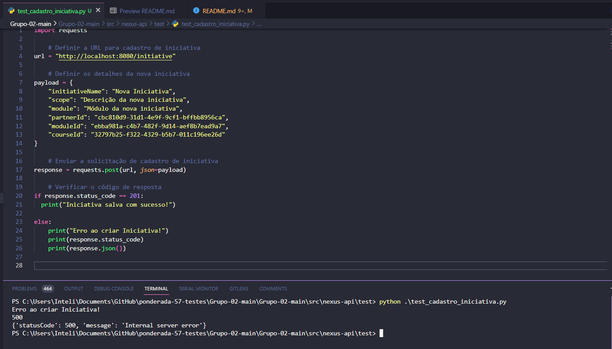

# ponderada-S7-testes

## Caso de Teste: Cadastro de uma Nova Iniciativa

Para realizar o teste, basta acessar a pasta test e executar o script .\test_cadastro_iniciativa.py através do comando python .\test_cadastro_iniciativa.py e verificar o terminal.

### Objetivo:

Verificar se um usuário pode cadastrar uma nova iniciativa no sistema com sucesso.

### Pré-condição:

O usuário está autenticado no sistema e tem permissão para cadastrar iniciativas.

### Procedimento de Teste:

- Enviar uma solicitação de cadastro de iniciativa com os detalhes da iniciativa, como título, descrição e categoria.
- Verificar o código de resposta para garantir que seja bem-sucedido (código 201, mensagem de sucesso).

### Resultado Esperado:
A solicitação de cadastro de iniciativa deve retornar um código de resposta bem-sucedido (201).

### Resultado Obtido:
A solicitação de cadastro de iniciativa retornou o código de resposta 201, com a mensagem de sucesso.

### Pós-condição:
Uma nova iniciativa foi cadastrada no sistema.

OBS: Foi adicionada uma condição de erro caso as informações estejam erradas:

